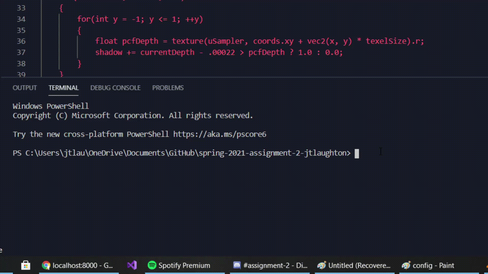
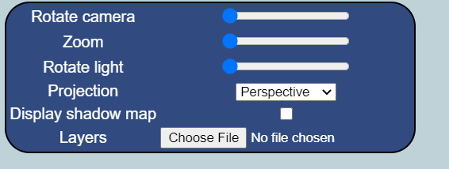

# CS425 - Computer Graphics I (Spring 2021)

## How To Run

In order to run you must first run the python script to start a web server. To do this you have to have python installed and then you open up a shell of your choosing, and change directories to the folder that contains the project. Once you're there type "python server.py" and it should open up the web server (A GIF showing this is below)

After that you type localhost:8000 into you're browser and you should be able to access the program. All of the interaction is done through the main configuration panel (shown below).

The main interactions from top to bottom are "Rotate Camera" which rotates the camera around the model, "Zoom" which zooms in on the model, "Rotate Light" which rotates the main light source around the model, "Projection" which changes the type of model projection, "Display Shadow Map" which shows you the shadow map texture that was generated in order to calculate shadows, and finally "Layers" which allows you to choose which json you want to use to define the layers. The GIF below shows all these in action.

## Methods Implemented

The main methods added were main draw function, the draw function in layer, the RenderToScreenProgram class, and the FBO class. Also all the vertex and fragment shaders had to be implemented. For the main draw function I had to just make sure to do the two passes, the first being the shadowmap creation, the second being either drawing the scene or drawing the map depending on the checkbox. For the layer funciton I had to make it so it either drew the scene from the lights perspective, or from the camera perspective depending on which pass we were on. For the RenderToScreenProgram it was a matter of defining the quad's verts, binding the vao, displaying the texture on the quad, and then drwaing the triangles. For the FBO I had to create the texture create and fbo, bind and clear in start, and unbind in stop. For the shaders the main implementation was in the shadowVert and shadowFrag files. First if we have normals we dot product the normals with the light direction and multiply that by our color's rgb values, otherwise just output uColor. Then you compute light space position and regular position by multiplying matrices. For shadowFrag I did the shadow calculation to get the depth information, then did percentage closer filtering to get smoother shadows.
